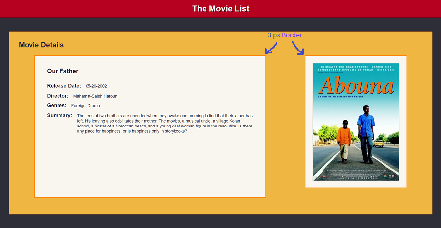
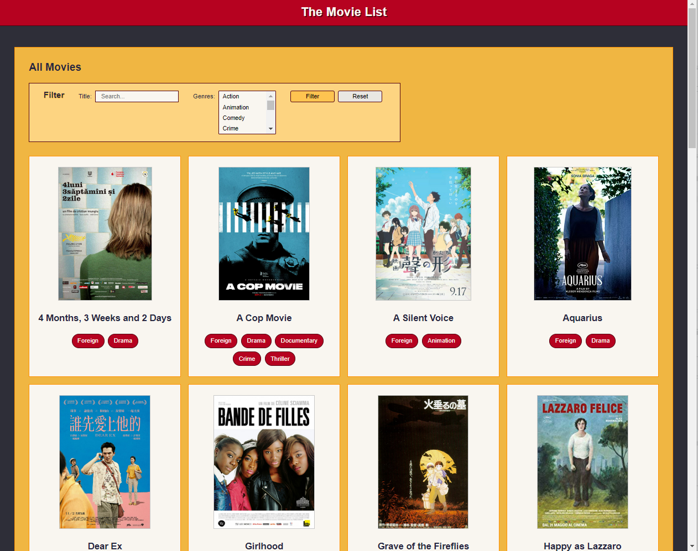

# Module Assessment - Part 2: Vue

## Introduction

This part of the hands-on assessment asks you to modify an existing Vue application. The application requires five modifications, each of which adds a new feature to the application. Your assignment is to add those five new features.

**After completing this part of the coding assessment, you need to `add`, `commit`, and `push` the code to your repository.**

**After completing both parts of the assessment, submit it to BootcampOS.**

## Hints and suggestions

* Each feature is independent of the others. If you become stuck, feel free to move on the next feature. You can revisit this work later, if you have time. 
* To facilitate your return to a challenging problem, leave comments describing the current state of your work. Be sure to comment out any code that prevents the application from running.
* `push` your code often. Whenever you feel like you've made good progress and your code builds, commit and push your changes.
* Your instructors can't evaluate your code if it doesn't build properly. _Please ensure you don't have any build errors before submitting your code._

## Exploring the code

Build and run the Vue application. Then explore the two files in in the `views` folder:

- The **All Movies** view is the main view for the application. It includes a text-based list of movies. You can modify this list using the working filter button, which allows you to search for films by title or by genre. 

- The **Movie Details** view is initially only accessible by entering http://localhost:5173/movies/details in your browser. This view currently displays details for the movie **Our Father**.


## Requirements

<hr>

### Task 1: Create an `AppHeader` component

Currently the `App.vue` component includes the definition of the application header. The plan is to add new features to the application header in the next release. To prepare for these changes, you must make the application header a separate component. 

Create a new Vue component called `AppHeader`. Then move the existing `#app-header` element and its related styles into this new file. Import and use the new component in `App.vue`. 

> Note: This task is structural, and doesn't change the application's appearance in any way. 

<hr>

### Task 2: Improve styling for the `MovieDetails` component

Low contrast between the background and font colors make the current `MovieDetails` component hard to read. Correct this by making two adjustments to the styling for both the movie details text and the movie poster:

- For the background, use the color `#F9F6F0`
- Add a 3 pixel border to the solid background using the color `#FF9000`

When completed correctly, the **MovieDetailsView** resembles the following image:  



> Note: that the position of movie poster may vary depending on the width of the browser display.

<hr>

### Task 3: Update the list of genres in the `MovieFilter` component

The `MovieFilter` component currently uses a hard-coded list of 3 genres. Update it to get the list of genres from the server API. This requires two changes:  

- Create a new method in the `MovieService` to get the genre list from the server. Use the API path `/movies-api/genres`.

- Modify `MovieFilter` so that when it's loaded it uses the `MovieService` to populate the `allGenres` array.

When complete the **AllMoviesView** filter displays a scrollable list of 15 different genres, from Action to Western.

<hr>

### Task 4: Make the `MovieDetailsView` dynamic

Currently you can only access `MovieDetailsView` by entering the path `/movies/details` in your browser. This view shows details for the movie **Our Father**, which has the ID `102230`. 

Update the application router so that `MovieDetailsView` can display the details for any movie. Use the path `/movies/nnnnn`, where `nnnnn` is a movie's numeric id. For example, you would access **Our Father** using the path `/movies/102230`.

Here are a few other examples you can use for testing:
- /movies/102200 - Wadjda
- /movies/102225 - Solaris
- /movies/102228 - Grave of the Fireflies

<hr>

### Task 5: Update display of the `MovieList` component 

The `MovieList` component currently shows the list of movies as a string of JSON text. 

```JavaScript
<template>
  <div id="card-container">
    {{JSON.stringify(movieList)}}
  </div>
</template>
```

The recently added `MovieCard` component displays preview information for a specific movie. Update the `MovieList` component to iterate over the array of movies, displaying each film's information in a `MovieCard` component. The `MovieCard` is already configured to navigate to the `MovieDetailsView` when clicking on a card.

When complete, the **AllMoviesView** resembles the following image:  



Note that the number of movies displayed per row may vary based on the width of the browser window.

> Note: Even if you weren't able to complete Task 4, you can still finish Task 5. Even if every `MovieCard` directs you to the details for **Our Father**, you still have fulfilled all of the Task 5 requirements. 


## Submit your work

When you've completed this part of the assessment, be sure to push your code to your repository. If you've finished both parts of the coding assessment, submit the assessment in BootcampOS.

