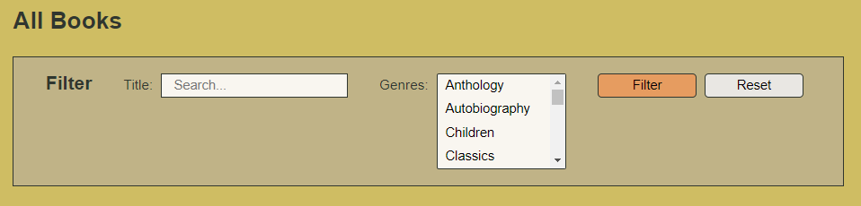
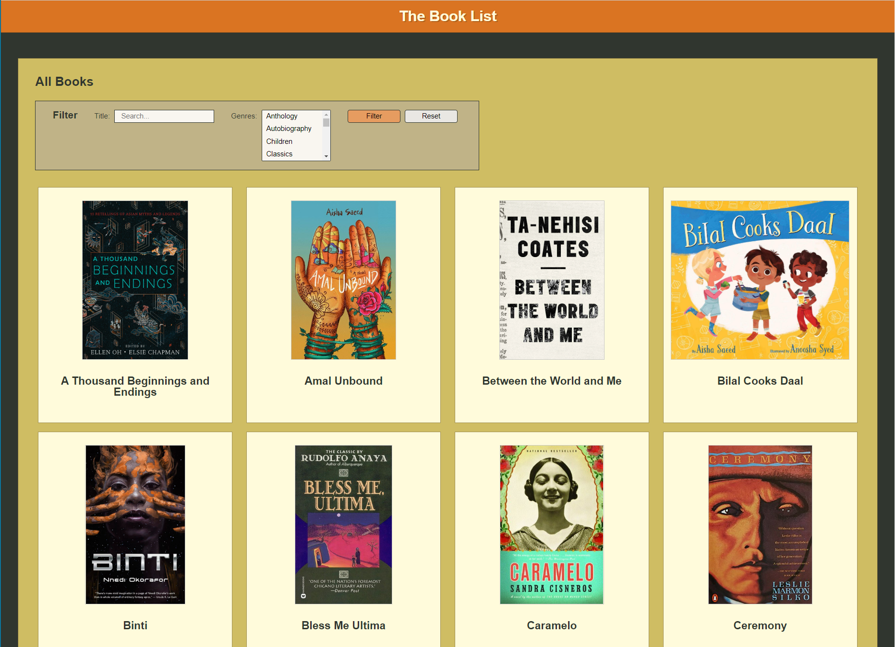
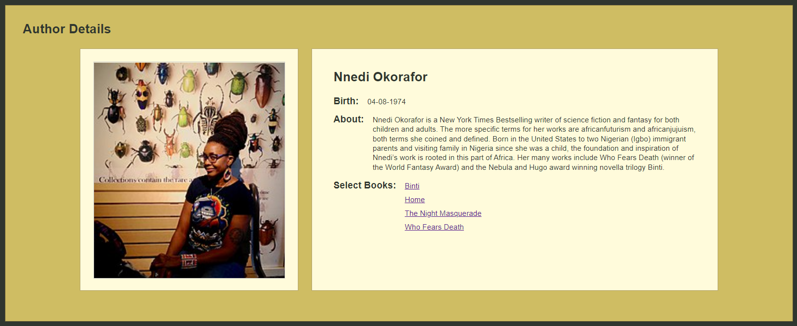

# Module Practice Assessment - Part 2: Vue

## Introduction

This part of the hands-on assessment starts with an existing Vue project where some features are incomplete. There are six independent tasks required for you to complete the current application features.

**After completing this part, you may `add`, `commit`, and `push` the code to your repository. Since this is a practice assessment, it's not graded and you don't need to submit this assessment to BootcampOS.**

## Hints and suggestions

* Each of the feature updates is independent of the others. If you become stuck on one feature, make some notes in comments on your thought process, then comment out any code that prevents the application from building and running, and move on to the next feature. You can revisit this work later, if you have time.
* `push` your code often. Whenever you reach a point where you feel like you've made good progress and your code builds, commit and push your changes.
* The code you submit must build properly. _Please make sure you don't have any build errors._

## Exploring the code

Build and run the Vue application.

There are three application views in the `views` folder:

- The **All Books** view is the main view shown for the application. It includes a search filter and a list of matching books. Currently the books display as text only, but notice that the filter does properly filter the list.

- The **Book Details** view is initially only accessible by entering the URL http://localhost:5173/books/details on the browser address bar. This view currently always shows the details for the book **A Thousand Beginnings and Endings**.

- The **Author Details** view is also only accessible by entering the URL http://localhost:5173/authors/nnnnnn on the browser address bar, replacing `nnnnnn` with an author id such as 302222. This view currently only displays the information for the author **Nnedi Okorafor**, regardless of the id entered in the URL.

## Requirements

<hr>

### Task 1: Create an `AppHeader` component

Currently the application header is part of the template and styles in the `App.vue` component. Your team has plans to add new features to the header. To prepare for that work, make the application header a separate component. 

Create a new Vue component called `AppHeader`, moving the existing `#app-header` element and its related styles to the new component file. Then import and use the new component in `App.vue`. 

> Note: This task doesn't visually change the application. It's only a behind the scenes structural code change. 

<hr>

### Task 2: Improve styling for the `BookListFilter` component

Initial feedback from testing has suggested styling changes for the `BookListFilter` component to ensure that it stands out on the page. This feedback also suggests making the "Filter" button more distinct since it's the primary form action. 

Update the `BookListFilter` to:
- Add a solid background to the component using the color `#C0B387` and a 1 pixel solid border using the color `#30362F`.
- Alter the background color for "Filter" submit button to be `#E69C60`.

When completed correctly, the **BookListFilter** displays similar to the following image:



<hr>

### Task 3: Make the `BookDetailsView` dynamic

The `BookDetailsView` is currently accessed using the path `/books/details` and only shows the book with the ID `102230`, **A Thousand Beginnings and Endings**. Update the application router so that this view displays the details for any book using the path `/books/nnnnnn`, where `nnnnnn` is the numeric id for any book. The details for the book **A Thousand Beginnings and Endings** is then accessed with the path `/books/102230`.

When completed correctly, the details for any book is accessible by id. Some examples you may use for testing are:
- /books/102203 - The House on Mango Street
- /books/102213 - The Prophet
- /books/102233 - Bilal Cooks Daal

<hr>

### Task 4: Update the `BookList` component display

The `BookList` component currently shows each book as a string of JSON text:

```JavaScript
<template>
  <div id="card-container">
    <div v-for="book of bookList" v-bind:key="book.id" v-bind:book="book">
      {{JSON.stringify(book)}}
    </div>
  </div>
</template>
```

The recently added `BookCard` component displays preview information for a specific book. Update the `BookList` to use this new `BookCard` component to display each book. The `BookCard` is already configured to navigate to the `BookDetailsView` when clicking on a card.

When complete, the **AllBooksView** resembles the following image:



Note that the number of books displayed per row may vary based on the width of the browser window.

> Note: If you skipped or had issues with the task to update the `BookDetailsView` to be dynamic, you can still setup the navigation to the `BookDetailsView`. It just always shows the details for the book **A Thousand Beginnings and Endings**.

<hr>

### Task 5: Make the `AuthorDetailsView` dynamic

The `AuthorDetailsView` component is currently hard-coded with the data for the author **Nnedi Okorafor**. Update it to get the author information from the server API.   

- Create a new method in the `BookService` to get this information from the Books API. Use the path `/books-api/authors/nnnnnn` where `nnnnnn` is the id of the author.

- Update the view component to use the `BookService` to populate the `authorData` property when the component is first loaded. Make sure not to update `isLoading=false` until the data is back from the server. If the server sends back an error, update the `error` property with an appropriate error message.

When completed correctly, the **AuthorDetailsView** displays information for the correct author id. Some examples you may use for testing are:
- /authors/302210 - John Okada
- /authors/302220 - Ellen Oh
- /authors/302225 - Roshani Chokshi

<hr>

### Task 6: Update the `AuthorDetails` component 

The `AuthorDetails` component shows some author information but doesn't currently display the selected books in the collection from that author. This information is available in the author JSON. Update the component to list just the book titles making them links to the **BookDetailsView**.

When completed correctly, the **AuthorDetails** component displays similar to the following image:



> Note: If you skipped or had issues with the task to update the `AuthorDetailsView` to be dynamic, you can still update the `AuthorDetails` component to add the author list. It just always shows the information for the author **Nnedi Okorafor**.

